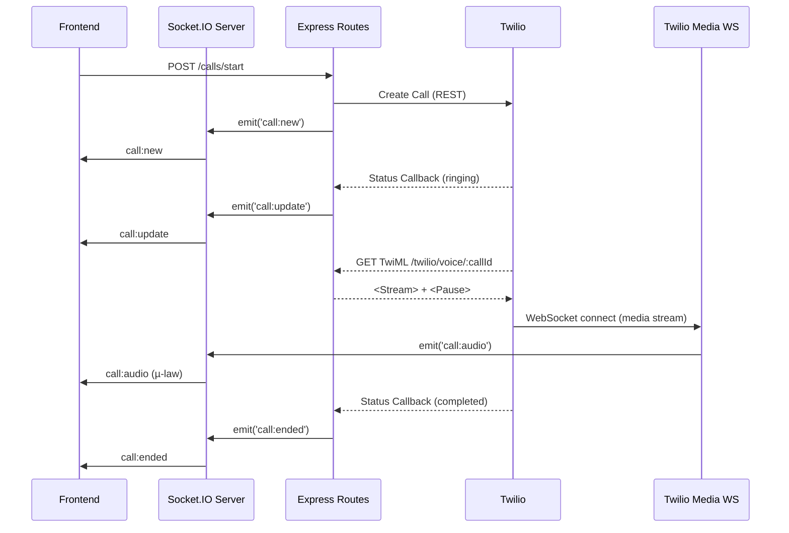
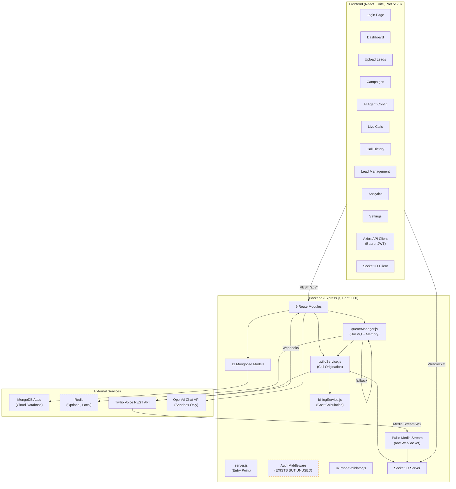
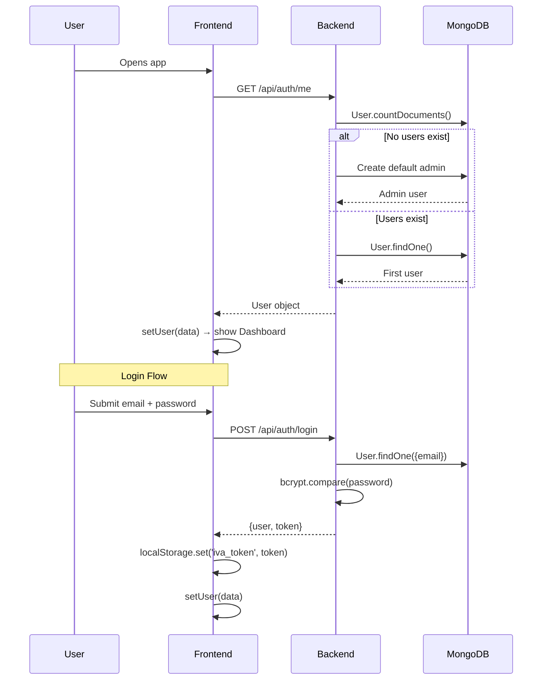
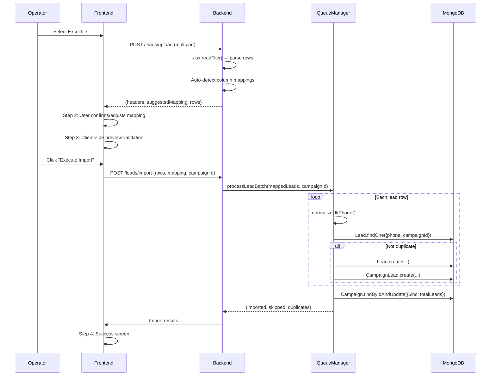
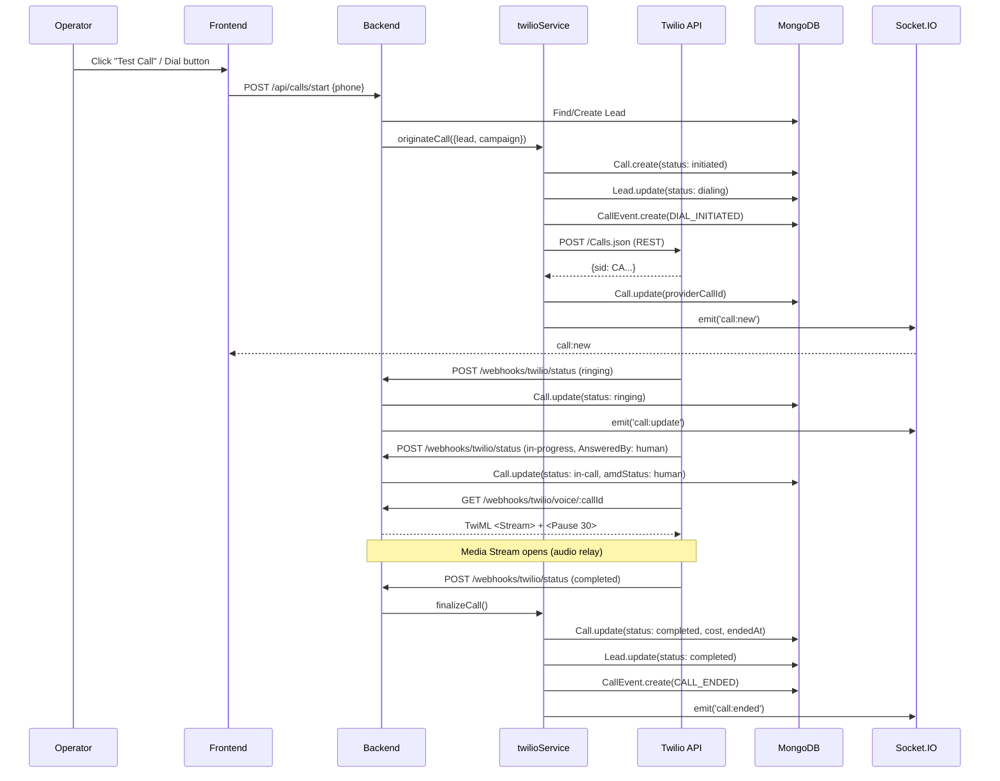

# PROJECT_ARCHITECTURE.md — UK IVA Cold Calling & Lead Qualification CRM Platform

> **Generated**: 2026-09-18  
> **Purpose**: Complete Phase 1 architecture documentation for developer/AI onboarding before Phase 2  
> **Repository inspected**: Every source file read and traced; no assumptions made

---

## Table of Contents

1. [Project Overview](#1-project-overview)
2. [Complete Repository Structure](#2-complete-repository-structure)
3. [Technology Stack](#3-technology-stack)
4. [Backend Architecture](#4-backend-architecture)
5. [Backend Request Flow](#5-backend-request-flow)
6. [API Inventory](#6-api-inventory)
7. [Database Architecture](#7-database-architecture)
8. [Frontend Architecture](#8-frontend-architecture)
9. [Frontend → Backend Communication](#9-frontend--backend-communication)
10. [Authentication and Security](#10-authentication-and-security)
11. [Voice / Telephony Architecture](#11-voice--telephony-architecture)
12. [AI / LLM Architecture](#12-ai--llm-architecture)
13. [Realtime Architecture](#13-realtime-architecture)
14. [Call Flow](#14-call-flow)
15. [Customer Data Flow](#15-customer-data-flow)
16. [State Management](#16-state-management)
17. [Environment Variables and Configuration](#17-environment-variables-and-configuration)
18. [Error Handling](#18-error-handling)
19. [Logging and Observability](#19-logging-and-observability)
20. [Testing](#20-testing)
21. [Current Feature Inventory](#21-current-feature-inventory)
22. [Current Architecture Diagram](#22-current-architecture-diagram)
23. [Important Sequence Diagrams](#23-important-sequence-diagrams)
24. [File-by-File Important Code Map](#24-file-by-file-important-code-map)
25. [Dependency Graph](#25-dependency-graph)
26. [Code Quality / Architectural Observations](#26-code-quality--architectural-observations)
27. [Scalability Considerations](#27-scalability-considerations)
28. [Security / Privacy Considerations](#28-security--privacy-considerations)
29. [Current End-to-End System Flow](#29-current-end-to-end-system-flow)
30. ["What I Have Built So Far" Summary](#30-what-i-have-built-so-far-summary)
31. [Future Development Context](#31-future-development-context)

---

## 1. PROJECT OVERVIEW

### What This Application Currently Does

This is an **enterprise outbound AI cold-calling platform and CRM** tailored for **UK IVA (Individual Voluntary Arrangement) debt relief lead qualification**. It enables operators to:

- Upload prospect/lead data from Excel/CSV files
- Organize leads into dialing campaigns with pacing and concurrency controls
- Initiate outbound calls via **Twilio Voice API** to UK phone numbers
- Monitor live calls in real time via WebSocket (Socket.IO)
- View call history with filters, transcripts, dispositions, and cost tracking
- Configure an AI voice agent persona (prompts, scripts, qualification rules)
- Test the AI agent via a text-based sandbox
- View analytics funnels (dialed → answered → human → qualified → transferred)
- Manage platform settings (billing rates, AMD tuning, user accounts)

### Problem Being Solved

Automate outbound cold-calling to UK consumers who may qualify for IVA debt relief, replacing manual call-center agents with an AI voice agent that qualifies prospects and warm-transfers them to human specialists when they meet qualification criteria (≥ £5,000 unsecured debt, ≥ 2 creditors, UK resident).

### Current Phase 1 Implementation Status

#### CURRENTLY IMPLEMENTED
- Full 10-screen React frontend (Login, Dashboard, Upload Leads, Campaigns, AI Agent, Live Calls, Call History, Lead Management, Analytics, Settings)
- Express.js REST API with 9 route modules (auth, leads, campaigns, calls, AI, transfers, analytics, settings, webhooks)
- MongoDB Atlas database with 11 Mongoose models
- JWT-based authentication (with development bypass)
- Lead upload wizard (Excel/CSV → column mapping → validation → import)
- Campaign CRUD with start/pause/stop lifecycle
- Twilio Voice outbound calling via REST API (not SDK)
- Twilio AMD (Answering Machine Detection) via `MachineDetection` parameter
- Twilio Media Streams WebSocket handler for audio relay
- BullMQ job queues with Redis (with in-memory fallback for local dev)
- Socket.IO real-time event broadcasting (call:new, call:update, call:ended, call:audio)
- Billing/cost calculation per call
- UK phone number normalization and validation
- Database seed script with sample data
- AI sandbox chat (text-based only, using OpenAI Chat Completions API or simulated response)
- AgentPrompt model with full system prompt, qualification rules, transfer scripts, voicemail messages

#### PLANNED / IMPLIED (evidence exists in code/models/README but not fully wired)
- **OpenAI Realtime Voice API integration**: The `OPENAI_REALTIME_MODEL` env var is defined, `AgentPrompt.systemPrompt` references tool calls (`mark_interested`, `transfer_call`, `end_call`, `save_notes`, `schedule_callback`, `update_disposition`), but NO code implements an actual OpenAI Realtime WebSocket connection or tool-call processing
- **Asterisk PBX integration**: README documents Asterisk architecture and deployment scripts, but NO `asterisk/` directory exists in the repo, NO ARI client code, NO PJSIP configuration
- **AudioSocket TCP 9092**: Referenced in README diagram but no implementation
- **Call recording storage/playback**: `Call.recordingUrl` field exists but is never populated
- **Live transcript streaming**: Frontend listens for `transcript:update` events but backend never emits them
- **Call duration timer updates**: Frontend listens for `call:duration` events but backend never emits them
- **Password reset**: Frontend has a "Forgot Password" UI form but it only sets local state (`setResetSent(true)`) — NO backend endpoint, NO email sent
- **FreeSWITCH / WebRTC**: Not referenced anywhere in the codebase

#### NOT IMPLEMENTED
- Realtime AI voice conversation (no OpenAI Realtime WebSocket client)
- Call recording / transcription pipeline
- RAG / knowledge base / vector database
- Agent memory / learning
- Campaign scheduling (calling hours enforcement)
- DNC/TPS list checking
- Human handoff workflow (beyond simple Twilio `<Dial>`)
- Multi-tenancy / company isolation
- RBAC authorization (roles exist on model but are never enforced)
- Rate limiting
- Input validation middleware (beyond basic checks)
- Testing (zero test files)
- Docker / containerization
- CI/CD pipeline
- Logging infrastructure (console.log only)

### Overall Current Architecture

```
React Frontend (Vite, port 5173)
         │
         ├── REST API (axios → /api/*)  ──proxy──→  Express.js (port 5000)
         │                                              │
         └── Socket.IO (WebSocket)  ──proxy──→  Socket.IO Server
                                                        │
                                         ┌──────────────┼──────────────────┐
                                         ▼              ▼                  ▼
                                    MongoDB Atlas   Redis / BullMQ    Twilio REST API
                                   (Mongoose ORM)   (optional)       (outbound calls)
                                                                          │
                                                                     Twilio Webhooks
                                                                    (status callbacks)
                                                                          │
                                                                  Twilio Media Streams
                                                                   (raw WS on /api/webhooks/twilio/media/*)
```

---

## 2. COMPLETE REPOSITORY STRUCTURE

```
start (2)/
├── README.md                          # Project overview, architecture diagram, quick start, 10-screen description
├── start.bat                          # Windows batch script: launches backend + frontend in separate terminals
├── PROJECT_ARCHITECTURE.md            # This document
│
├── backend/
│   ├── .env                           # Environment variables (DB, Redis, Twilio, OpenAI, JWT)
│   ├── package.json                   # npm dependencies and scripts
│   ├── package-lock.json              # Dependency lock file
│   ├── uploads/                       # Temp directory for multer file uploads (currently empty)
│   └── src/
│       ├── server.js                  # Application entry point: Express + HTTP + Socket.IO + queue init
│       ├── seed.js                    # Database seed script (Company, Admin User, Agent, Campaign, Leads, Dispositions, Settings)
│       │
│       ├── config/
│       │   ├── db.js                  # MongoDB/Mongoose connection (Atlas or local), DNS override, status helper
│       │   └── redis.js               # ioredis client with graceful fallback when Redis is offline
│       │
│       ├── controllers/
│       │   └── authMiddleware.js      # JWT auth middleware with dev fallback (allows unauthenticated access)
│       │
│       ├── models/
│       │   ├── User.js                # User model (name, email, password, role, companyId) with bcrypt pre-save
│       │   ├── Company.js             # Company model (name, ukCompanyNumber, contactEmail, transferPhone)
│       │   ├── Lead.js                # Lead/prospect model (phone, name, debt, creditors, status, campaign link)
│       │   ├── Campaign.js            # Campaign model (name, calling hours, CPS, concurrency, counters)
│       │   ├── Call.js                # Call record (callId, status, aiStatus, amdStatus, transcript, cost)
│       │   ├── CallEvent.js           # Call lifecycle event log (DIAL_INITIATED, ANSWERED, TRANSFER, etc.)
│       │   ├── CampaignLead.js        # Junction: Campaign ↔ Lead many-to-many with per-campaign status
│       │   ├── AgentPrompt.js         # AI agent persona (scripts, prompts, qualification rules, voice)
│       │   ├── Disposition.js         # Call outcome codes (QUALIFIED, NOT_INTERESTED, DNC, etc.)
│       │   ├── Transfer.js            # Transfer record (callId, destination, status, reason)
│       │   └── Settings.js            # Singleton global config (AMD tuning, dialer limits, billing rates)
│       │
│       ├── routes/
│       │   ├── authRoutes.js          # POST /register, /login, /logout, GET /me
│       │   ├── leadRoutes.js          # POST /upload, /import; GET /, /:id; PUT /:id; DELETE /:id
│       │   ├── campaignRoutes.js      # CRUD + POST /:id/start, /pause, /stop, /assign-leads
│       │   ├── callRoutes.js          # GET /, /live, /:id; POST /start, /:id/hangup, /:id/transfer
│       │   ├── aiRoutes.js            # GET /agent, /agent/:id; POST /agent; PUT /agent/:id; POST /test
│       │   ├── transferRoutes.js      # GET / (list recent transfers)
│       │   ├── analyticsRoutes.js     # GET / (aggregated KPIs, hourly distribution, disposition breakdown)
│       │   ├── settingsRoutes.js      # GET /, PUT /, POST /test-db (deprecated), users CRUD
│       │   └── webhookRoutes.js       # POST /twilio, /twilio/status, /twilio/voice/:callId
│       │
│       ├── services/
│       │   ├── twilioService.js       # Core telephony: originateCall, transferCall, hangupCall, finalizeCall
│       │   ├── twilioMediaStream.js   # Raw WebSocket server for Twilio Media Streams → Socket.IO relay
│       │   ├── billingService.js      # calculateCallCost (Twilio + OpenAI per-minute rates)
│       │   └── ukPhoneValidator.js    # normalizeUkPhone (→ E.164 +44), isUkMobile
│       │
│       ├── queues/
│       │   └── queueManager.js        # BullMQ lead import + dialer queues (with in-memory fallback)
│       │
│       └── websocket/
│           └── socketServer.js        # Socket.IO init, handles call:transfer_manual, call:hangup_manual
│
└── frontend/
    ├── index.html                     # HTML entry with SVG phone favicon, dark theme body class
    ├── package.json                   # npm dependencies and scripts
    ├── package-lock.json              # Dependency lock
    ├── vite.config.js                 # Vite dev server: port 5173, proxy /api → :5000, proxy /socket.io
    ├── tailwind.config.js             # TailwindCSS config with custom brand teal color palette
    ├── postcss.config.js              # PostCSS: tailwindcss + autoprefixer
    ├── dist/                          # Pre-built production bundle (exists)
    └── src/
        ├── main.jsx                   # React entry: AuthProvider → SocketProvider → App
        ├── App.jsx                    # Tab-based routing (useState activeTab), renders all 10 screens
        ├── index.css                  # Tailwind directives + custom scrollbar + waveform animation
        │
        ├── components/
        │   └── Layout.jsx             # Sidebar nav + header with UK time + quick dial form + live count
        │
        ├── context/
        │   ├── AuthContext.jsx         # React Context: user state, login, logout, checkUser via /auth/me
        │   └── SocketContext.jsx       # React Context: Socket.IO client, connection status
        │
        ├── services/
        │   └── api.js                 # Axios instance: baseURL=/api, Bearer token interceptor
        │
        └── pages/
            ├── Login.jsx              # Login form + forgotten password UI (forgot password is mocked)
            ├── Dashboard.jsx          # 9 KPI cards + campaign list with start/pause controls
            ├── UploadLeads.jsx        # 4-step wizard: Upload → Map Columns → Validate → Import Complete
            ├── Campaigns.jsx          # Campaign list + create modal + assign-leads + start/pause/stop
            ├── AiAgent.jsx            # Agent persona config form + AI sandbox chat (left/right layout)
            ├── LiveCalls.jsx          # Live call monitor: call list + detail pane with waveform + transcript
            ├── CallHistory.jsx        # Call log table with 6-filter bar + transcript inspection modal
            ├── LeadManagement.jsx     # Lead CRM table with search, status filter, one-click dial
            ├── Analytics.jsx          # Metrics grid + conversion funnel + disposition breakdown
            └── Settings.jsx           # Billing rates + webhook URLs (display-only) + user management CRUD
```

### Key Observations About Structure
- **No separate controller layer**: Route files contain both routing and business logic inline (no dedicated controllers directory beyond `authMiddleware.js` which is misplaced)
- **`authMiddleware.js` is in `/controllers/`** but is actually middleware — naming inconsistency
- **No dedicated `middleware/` directory**
- **No TypeScript**: Entire codebase is JavaScript
- **No `.gitignore` file** visible in the repository root
- **No `.env.example`** file (credentials are directly in `.env`)
- **No Docker files** exist in the repository (README references an `asterisk/` directory that doesn't exist)

---

## 3. TECHNOLOGY STACK

| Category | Technology | Version | Where Used | How Used |
|---|---|---|---|---|
| **Frontend Framework** | React | 18.3.1 | `frontend/` | Component-based UI, useState/useEffect hooks |
| **Frontend Build Tool** | Vite | 6.1.0 | `frontend/vite.config.js` | Dev server with API proxy, HMR |
| **Frontend Styling** | TailwindCSS | 3.4.17 | All `.jsx` components | Utility-first CSS via class names |
| **Frontend CSS Post-processing** | PostCSS + Autoprefixer | 8.5.2 / 10.4.20 | `postcss.config.js` | Process Tailwind directives |
| **Frontend Icons** | lucide-react | 0.475.0 | All page/layout components | SVG icon components |
| **Frontend HTTP Client** | axios | 1.7.9 | `services/api.js` | REST API calls with Bearer token interceptor |
| **Frontend CSS Utilities** | clsx, tailwind-merge | 2.1.1 / 3.0.1 | `package.json` | Class name merging (imported but NOT used in any component) |
| **Frontend WebSocket** | socket.io-client | 4.8.1 | `context/SocketContext.jsx` | Real-time call events |
| **Backend Runtime** | Node.js | v18+ / v25+ | `backend/` | Server runtime |
| **Backend Framework** | Express.js | 4.21.2 | `server.js` | HTTP server, routing, middleware |
| **Backend Language** | JavaScript (CommonJS) | ES2020+ | All `.js` files | `require()` module system |
| **Database** | MongoDB (Atlas) | — | `config/db.js` | Primary data store, cloud-hosted |
| **ORM** | Mongoose | 8.12.0 | `models/*.js` | Schema definition, validation, queries |
| **Authentication** | jsonwebtoken (JWT) | 9.0.2 | `authRoutes.js`, `authMiddleware.js` | Bearer token auth, 30-day expiry |
| **Password Hashing** | bcryptjs | 2.4.3 | `models/User.js` | Pre-save hash with salt 10 |
| **Job Queue** | BullMQ | 5.41.0 | `queues/queueManager.js` | Lead import + dialer job queues |
| **Queue Backing Store** | Redis (ioredis) | 5.5.0 | `config/redis.js` | BullMQ connection (optional, falls back to memory) |
| **WebSocket (App-level)** | Socket.IO | 4.8.1 | `websocket/socketServer.js` | Frontend ↔ Backend real-time events |
| **WebSocket (Telephony)** | ws | 8.18.0 | `services/twilioMediaStream.js` | Twilio Media Streams raw WebSocket |
| **File Upload** | multer | 1.4.5-lts.1 | `routes/leadRoutes.js` | Excel/CSV file upload handling |
| **Spreadsheet Parsing** | xlsx (SheetJS) | 0.18.5 | `routes/leadRoutes.js` | Parse .xlsx/.xls/.csv to JSON |
| **UUID Generation** | uuid | 11.1.0 | `services/twilioService.js` | Generate unique call IDs |
| **HTTP Client (Backend)** | axios | 1.7.9 | `services/twilioService.js`, `routes/aiRoutes.js` | Twilio REST API, OpenAI API calls |
| **CORS** | cors | 2.8.5 | `server.js` | `origin: '*'` (wide open) |
| **Env Config** | dotenv | 16.4.7 | `server.js`, `seed.js` | Load `.env` variables |
| **Dev Tooling** | nodemon | 3.1.9 | `package.json` scripts | Auto-restart on file changes |
| **Telephony Provider** | Twilio Voice REST API | — | `services/twilioService.js` | Outbound calls, AMD, transfers |
| **AI Provider** | OpenAI (Chat Completions) | — | `routes/aiRoutes.js` | Text sandbox test only (gpt-4o-mini) |
| **API Architecture** | REST | — | All routes | JSON request/response |
| **State Management** | React useState + Context | — | All components | Local + context state |
| **Validation** | Manual inline checks | — | Route handlers | Basic null/empty checks |
| **Logging** | console.log/warn/error | — | Throughout | No structured logging |
| **Error Handling** | Express error middleware | — | `server.js` | Catch-all 500 handler |
| **Testing** | **NONE** | — | — | Zero test files in the project |
| **Package Manager** | npm | — | `package-lock.json` | Dependency management |

### Notable Unused Dependencies
- `clsx` and `tailwind-merge` are listed in frontend `package.json` but are **never imported** in any source file

---

## 4. BACKEND ARCHITECTURE

### Entry Point

**File**: `backend/src/server.js`

The server bootstraps in this order:
1. Load environment variables (`dotenv`)
2. Create Express app and HTTP server
3. Configure middleware: CORS (`origin: '*'`), JSON parser (50MB limit), URL-encoded parser
4. Initialize Socket.IO server via `initSocketServer(httpServer)`
5. Initialize Twilio Media Stream WebSocket handler via `initTwilioMediaStream(httpServer, io)`
6. Wire Socket.IO reference into `twilioService` via `setTwilioSocketIO(io)` (note: this is called TWICE — once in `socketServer.js` and once in `server.js`)
7. Mount 9 API route modules under `/api/`
8. Add health check endpoint at `GET /api/health`
9. Add global error handler middleware
10. Connect to MongoDB via `connectDB()`
11. Initialize BullMQ queues via `initQueues()`
12. Start HTTP server on `PORT` (default 5000)

### Routes (No Controllers)

The backend uses a **flat route-handler pattern** — route files contain all business logic inline. There are no dedicated controller files. The `authMiddleware.js` is the only file in `controllers/` and it serves as middleware, not a controller.

**IMPORTANT**: No route is protected by `authMiddleware.js`. The `protect` middleware is exported but **never imported or applied** to any route. All API endpoints are publicly accessible.

### Services

| Service | File | Responsibility |
|---|---|---|
| `twilioService` | `services/twilioService.js` | Core telephony: originate calls via Twilio REST API, transfer calls, hangup calls, finalize calls with billing, emit Socket.IO events |
| `twilioMediaStream` | `services/twilioMediaStream.js` | Raw WebSocket server for Twilio Media Streams — relays `mulaw` audio payloads to frontend via Socket.IO `call:audio` event |
| `billingService` | `services/billingService.js` | Calculates call cost: `(durationSec / 60) * (twilioRate + openAiRate)` in GBP |
| `ukPhoneValidator` | `services/ukPhoneValidator.js` | Normalizes UK phone numbers to E.164 format (+44...), validates against UK mobile/landline regex |

### Queue System

**File**: `queues/queueManager.js`

Two BullMQ queues with Redis backing (or in-memory fallback):

1. **`leadQueue`**: Processes imported lead batches — validates phones, normalizes to +44, deduplicates, saves to MongoDB
2. **`dialQueue`**: Dispatches outbound calls — checks campaign concurrency limits, calls `twilioService.originateCall()`

The in-memory fallback uses a simple array (`memoryDialQueue`) with a `setInterval` loop processing 1 call/second.

### WebSocket Server

**File**: `websocket/socketServer.js`

Socket.IO server with two client event handlers:
- `call:transfer_manual` → calls `twilioService.transferCall()`
- `call:hangup_manual` → calls `twilioService.hangupCall()`

Server emits (from `twilioService` and `webhookRoutes`):
- `call:new` — when a call is initiated
- `call:update` — when call status changes
- `call:ended` — when a call completes
- `call:audio` — raw µ-law audio from Twilio Media Streams

**NOT emitted by backend (but frontend listens for them)**:
- `call:duration` — never emitted
- `transcript:update` — never emitted

---

## 5. BACKEND REQUEST FLOW

### Typical API Request Flow

```
Frontend (React)
  ↓ axios.get/post/put/delete('/api/...')
  ↓ Bearer token attached by interceptor (if token in localStorage)
  ↓ Vite proxy rewrites /api/* → http://localhost:5000/api/*
  ↓
Express.js Server
  ↓ cors() middleware (allows all origins)
  ↓ express.json() (50MB limit)
  ↓ Route matching
  ↓
Route Handler (inline business logic)
  ↓ Mongoose model operations (find, create, update, delete)
  ↓ (optional) External API call (Twilio, OpenAI)
  ↓ (optional) Socket.IO emit
  ↓
JSON Response → Frontend
```

### Example: Call Initiation Flow

```
POST /api/calls/start { phone, name, campaignId }
  ↓
callRoutes.js handler
  ↓ Find or create Lead in MongoDB
  ↓ Call twilioService.originateCall({ lead, campaign })
    ↓ Create Call document in MongoDB (status: 'initiated')
    ↓ Update Lead status to 'dialing', increment attempts
    ↓ Create CallEvent (DIAL_INITIATED)
    ↓ POST to Twilio REST API: /Accounts/{sid}/Calls.json
      ↓ Twilio initiates outbound call to lead.phone
      ↓ Twilio sends status callbacks to PUBLIC_BASE_URL/api/webhooks/twilio/status
    ↓ Update Call with providerCallId (Twilio SID)
    ↓ Emit socket 'call:new'
  ↓
Response: { success: true, callId, providerCallId }
```

---

## 6. API INVENTORY

| Method | Endpoint | Purpose | Auth | Request Body | Response | Route File | Service | Status |
|---|---|---|---|---|---|---|---|---|
| POST | `/api/auth/register` | Register new user | None | `{name, email, password, role}` | `{_id, name, email, role, token}` | authRoutes | — | IMPLEMENTED |
| POST | `/api/auth/login` | User login | None | `{email, password}` | `{_id, name, email, role, token}` | authRoutes | — | IMPLEMENTED |
| POST | `/api/auth/logout` | Logout (noop) | None | — | `{message}` | authRoutes | — | STUB (no session invalidation) |
| GET | `/api/auth/me` | Get current user | None | — | User object | authRoutes | — | IMPLEMENTED (auto-creates admin if DB empty) |
| POST | `/api/leads/upload` | Upload Excel/CSV | None | `multipart/form-data (file)` | `{fileName, totalRows, headers, suggestedMapping, previewRows, rows}` | leadRoutes | — | IMPLEMENTED |
| POST | `/api/leads/import` | Import mapped leads | None | `{rows, mapping, campaignId}` | `{message, imported, skipped, ...}` | leadRoutes | queueManager | IMPLEMENTED |
| GET | `/api/leads` | List leads (filtered) | None | Query: `campaignId, status, disposition, search, page, limit` | `{leads[], total, page, pages}` | leadRoutes | — | IMPLEMENTED |
| GET | `/api/leads/:id` | Get single lead | None | — | Lead object | leadRoutes | — | IMPLEMENTED |
| PUT | `/api/leads/:id` | Update lead | None | Any lead fields | Updated Lead | leadRoutes | — | IMPLEMENTED |
| DELETE | `/api/leads/:id` | Delete lead | None | — | `{message}` | leadRoutes | — | IMPLEMENTED |
| GET | `/api/campaigns` | List all campaigns | None | — | Campaign[] | campaignRoutes | — | IMPLEMENTED |
| POST | `/api/campaigns` | Create campaign | None | `{name, description, callingHoursStart, callingHoursEnd, maxCPS, concurrentCalls, agentId}` | Campaign | campaignRoutes | — | IMPLEMENTED |
| GET | `/api/campaigns/:id` | Get campaign + lead stats | None | — | `{campaign, leadStats}` | campaignRoutes | — | IMPLEMENTED |
| PUT | `/api/campaigns/:id` | Update campaign | None | Any campaign fields | Campaign | campaignRoutes | — | IMPLEMENTED |
| POST | `/api/campaigns/:id/assign-leads` | Assign unassigned leads | None | `{limit}` | `{message, assigned}` | campaignRoutes | — | IMPLEMENTED |
| POST | `/api/campaigns/:id/start` | Start campaign dialing | None | — | `{message, campaign}` | campaignRoutes | queueManager | IMPLEMENTED |
| POST | `/api/campaigns/:id/pause` | Pause campaign | None | — | `{message, campaign}` | campaignRoutes | — | IMPLEMENTED |
| POST | `/api/campaigns/:id/stop` | Stop campaign | None | — | `{message, campaign}` | campaignRoutes | — | IMPLEMENTED |
| GET | `/api/calls` | Call history (filtered) | None | Query: `dateFrom, dateTo, campaignId, disposition, interested, transferred, status, page, limit` | `{calls[], total, page, pages}` | callRoutes | — | IMPLEMENTED |
| GET | `/api/calls/live` | Active live calls | None | — | Call[] | callRoutes | — | IMPLEMENTED |
| GET | `/api/calls/:id` | Get call by ID or callId | None | — | Call | callRoutes | — | IMPLEMENTED |
| POST | `/api/calls/start` | Manual test call | None | `{phone, name, campaignId}` | `{success, callId, providerCallId}` | callRoutes | twilioService | IMPLEMENTED |
| POST | `/api/calls/:id/hangup` | Hangup call | None | `{reason}` | `{message, call}` | callRoutes | twilioService | IMPLEMENTED |
| POST | `/api/calls/:id/transfer` | Transfer call | None | `{destinationNumber, reason}` | `{success, target, providerCallId}` | callRoutes | twilioService | IMPLEMENTED |
| GET | `/api/ai/agent` | Get default agent config | None | — | AgentPrompt | aiRoutes | — | IMPLEMENTED |
| GET | `/api/ai/agent/:id` | Get agent by ID | None | — | AgentPrompt | aiRoutes | — | IMPLEMENTED |
| POST | `/api/ai/agent` | Create agent persona | None | AgentPrompt fields | AgentPrompt | aiRoutes | — | IMPLEMENTED |
| PUT | `/api/ai/agent/:id` | Update agent persona | None | AgentPrompt fields | AgentPrompt | aiRoutes | — | IMPLEMENTED |
| POST | `/api/ai/test` | AI sandbox test | None | `{message, systemPrompt, debtQuestions}` | `{reply, simulated?}` | aiRoutes | — | IMPLEMENTED (uses OpenAI Chat Completions or hardcoded simulation) |
| GET | `/api/transfers` | List recent transfers | None | — | Transfer[] (limit 100) | transferRoutes | — | IMPLEMENTED |
| GET | `/api/analytics` | Dashboard analytics | None | — | `{overview, hourlyCalls, dispositionBreakdown}` | analyticsRoutes | — | IMPLEMENTED |
| GET | `/api/settings` | Get global settings | None | — | Settings + dbStatus | settingsRoutes | — | IMPLEMENTED |
| PUT | `/api/settings` | Update settings | None | `{amd, dialer, billing}` | `{message, settings}` | settingsRoutes | — | IMPLEMENTED |
| POST | `/api/settings/test-db` | Test DB connection | None | — | 410 Gone | settingsRoutes | — | DEPRECATED |
| GET | `/api/settings/users` | List users | None | — | User[] | settingsRoutes | — | IMPLEMENTED |
| POST | `/api/settings/users` | Create user | None | `{name, email, password, role}` | User | settingsRoutes | — | IMPLEMENTED |
| DELETE | `/api/settings/users/:id` | Delete user | None | — | `{message}` | settingsRoutes | — | IMPLEMENTED |
| GET | `/api/health` | Health check | None | — | `{status, timestamp, service, callingProvider}` | server.js | — | IMPLEMENTED |
| POST | `/api/webhooks/twilio` | Twilio webhook | None | Twilio form fields | TwiML `<Response/>` | webhookRoutes | — | IMPLEMENTED |
| POST | `/api/webhooks/twilio/status` | Twilio status callback | None | Twilio status fields | 204 | webhookRoutes | twilioService | IMPLEMENTED |
| POST | `/api/webhooks/twilio/voice/:callId` | TwiML for answered call | None | — | TwiML (Media Stream + Pause) | webhookRoutes | — | IMPLEMENTED |

> **Critical**: Every endpoint has `Auth: None` because `protect` middleware is never applied.

---

## 7. DATABASE ARCHITECTURE

### Technology
- **Database**: MongoDB (Atlas cloud-hosted: `mongodb+srv://...mongodb.net/IVA`)
- **ORM**: Mongoose 8.12.0
- **Database Name**: `IVA` (from connection string)

### Collections & Schemas

#### User
| Field | Type | Required | Unique | Default | Notes |
|---|---|---|---|---|---|
| `name` | String | Yes | — | — | |
| `email` | String | Yes | Yes (lowercase, trimmed) | — | |
| `password` | String | Yes | — | — | bcrypt hashed on save |
| `role` | String (enum) | — | — | `'admin'` | Values: `admin`, `manager`, `agent` |
| `companyId` | ObjectId ref `Company` | — | — | — | |
| `active` | Boolean | — | — | `true` | |
| `createdAt` | Date | — | — | `Date.now` | |

#### Company
| Field | Type | Required | Default |
|---|---|---|---|
| `name` | String | Yes | — |
| `ukCompanyNumber` | String | — | `''` |
| `contactEmail` | String | — | `''` |
| `transferPhone` | String | — | `'+442080009999'` |
| `active` | Boolean | — | `true` |
| `createdAt` | Date | — | `Date.now` |

#### Lead
| Field | Type | Required | Index | Default | Notes |
|---|---|---|---|---|---|
| `phone` | String | Yes | Yes | — | E.164 format |
| `name` | String | Yes | — | — | |
| `email` | String | — | — | `''` | |
| `campaignId` | ObjectId ref `Campaign` | — | Yes | — | |
| `status` | String (enum) | — | Yes | `'new'` | Values: `new, queued, dialing, ringing, in-call, transferred, voicemail, completed, failed, dnc` |
| `attempts` | Number | — | — | `0` | |
| `lastCallAt` | Date | — | — | `null` | |
| `disposition` | String | — | — | `'Pending'` | |
| `interested` | Boolean | — | — | `false` | |
| `transferred` | Boolean | — | — | `false` | |
| `debtAmount` | Number | — | — | `0` | |
| `creditorCount` | Number | — | — | `0` | |
| `postcode` | String | — | — | `''` | |
| `notes` | String | — | — | `''` | |
| `lastCallId` | ObjectId ref `Call` | — | — | — | |
| `createdAt` | Date | — | — | `Date.now` | |

**Compound unique index**: `{ phone: 1, campaignId: 1 }`

#### Campaign
| Field | Type | Required | Index | Default |
|---|---|---|---|---|
| `name` | String | Yes | — | — |
| `description` | String | — | — | `''` |
| `callingHoursStart` | String | — | — | `'09:00'` |
| `callingHoursEnd` | String | — | — | `'19:00'` |
| `maxCPS` | Number | — | — | `2` |
| `concurrentCalls` | Number | — | — | `5` |
| `agentId` | ObjectId ref `AgentPrompt` | — | — | — |
| `status` | String (enum) | — | Yes | `'draft'` |
| `totalLeads` | Number | — | — | `0` |
| `dialedLeads` | Number | — | — | `0` |
| `answeredCalls` | Number | — | — | `0` |
| `voicemailCalls` | Number | — | — | `0` |
| `interestedLeads` | Number | — | — | `0` |
| `transferredCalls` | Number | — | — | `0` |
| `createdAt` | Date | — | — | `Date.now` |
| `updatedAt` | Date | — | — | `Date.now` |

#### Call
| Field | Type | Required | Index | Default | Notes |
|---|---|---|---|---|---|
| `callId` | String | Yes | Yes (unique) | — | Format: `twilio_{timestamp}_{uuid8}` |
| `providerCallId` | String | — | — | `''` | Twilio Call SID |
| `leadId` | ObjectId ref `Lead` | — | Yes | — | |
| `campaignId` | ObjectId ref `Campaign` | — | Yes | — | |
| `leadPhone` | String | Yes | — | — | |
| `callerId` | String | Yes | — | — | |
| `status` | String (enum) | — | Yes | `'initiated'` | 12 values |
| `aiStatus` | String (enum) | — | — | `'idle'` | 7 values |
| `amdStatus` | String (enum) | — | — | `'pending'` | `pending, human, machine, notsure` |
| `durationSec` | Number | — | — | `0` | |
| `startedAt` | Date | — | — | `Date.now` | |
| `answeredAt` | Date | — | — | — | |
| `endedAt` | Date | — | — | — | |
| `disposition` | String | — | — | `'In Progress'` | |
| `interested` | Boolean | — | — | `false` | |
| `transferred` | Boolean | — | — | `false` | |
| `transferDestination` | String | — | — | `''` | |
| `cost` | Number | — | — | `0.0` | GBP |
| `recordingUrl` | String | — | — | `''` | **Never populated** |
| `transcript` | Array of `{speaker, text, timestamp}` | — | — | — | **Never populated by backend** |
| `notes` | String | — | — | `''` | |
| `createdAt` | Date | — | — | `Date.now` | |

#### CallEvent
| Field | Type | Required | Index | Default |
|---|---|---|---|---|
| `callId` | String | Yes | Yes | — |
| `eventType` | String (enum) | Yes | — | — |
| `payload` | Mixed | — | — | `{}` |
| `timestamp` | Date | — | — | `Date.now` |

Event types: `DIAL_INITIATED, RINGING, ANSWERED, AMD_HUMAN_DETECTED, AMD_MACHINE_DETECTED, VOICEMAIL_DROP_PLAYED, AI_AGENT_CONNECTED, AI_TOOL_CALLED, LEAD_QUALIFIED, TRANSFER_REQUESTED, TRANSFER_COMPLETED, CALL_ENDED`

> Note: `webhookRoutes.js` stores events with type `'TWILIO_STATUS_CALLBACK'` which is NOT in the enum. This will cause Mongoose validation errors if strict validation is enabled.

#### CampaignLead
| Field | Type | Required | Index | Default |
|---|---|---|---|---|
| `campaignId` | ObjectId ref `Campaign` | Yes | Yes | — |
| `leadId` | ObjectId ref `Lead` | Yes | Yes | — |
| `status` | String (enum) | — | — | `'pending'` |
| `attempts` | Number | — | — | `0` |
| `lastAttemptAt` | Date | — | — | `null` |
| `createdAt` | Date | — | — | `Date.now` |

**Compound unique index**: `{ campaignId: 1, leadId: 1 }`

> Note: `CampaignLead` is created during lead import but is **never queried** anywhere in the application. It appears to be a planned junction table that is not yet utilized.

#### AgentPrompt
| Field | Type | Default | Notes |
|---|---|---|---|
| `name` | String (required) | `'UK IVA Senior Debt Advisor'` | |
| `companyName` | String (required) | `'Beacon Debt Advisory'` | |
| `agentName` | String (required) | `'Sarah Collins'` | |
| `voice` | String | `'alloy'` | OpenAI realtime voice identifier |
| `language` | String | `'en-GB'` | |
| `openingScript` | String | Long UK IVA opening script | |
| `debtQuestions` | Array of `{question, field, expectedType}` | 3 default questions | |
| `qualificationRules` | Object `{minDebtAmount, minCreditors, acceptedRegions, employedOrRegularIncome}` | `{5000, 2, [England, Wales, NI], true}` | |
| `transferRules` | Object `{autoTransferOnQualified, transferScript, fallbackOnHoldFailure}` | Includes scripts | |
| `voicemailMessage` | String | Pre-recorded voicemail drop text | |
| `systemPrompt` | String | Full GPT system prompt with tool-call instructions | Tool names referenced but NOT implemented |
| `isDefault` | Boolean | `true` | |
| `createdAt` | Date | `Date.now` | |
| `updatedAt` | Date | `Date.now` | |

#### Disposition
| Field | Type | Required | Unique | Default |
|---|---|---|---|---|
| `code` | String | Yes | Yes | — |
| `label` | String | Yes | — | — |
| `category` | String (enum) | — | — | `'neutral'` |
| `isInterested` | Boolean | — | — | `false` |
| `isTransfer` | Boolean | — | — | `false` |
| `isDnc` | Boolean | — | — | `false` |
| `createdAt` | Date | — | — | `Date.now` |

> Note: Dispositions are seeded but **never queried** by the application. Call dispositions are stored as free-text strings on Call/Lead, not referencing this collection.

#### Transfer
| Field | Type | Required | Index |
|---|---|---|---|
| `callId` | String | Yes | Yes |
| `leadId` | ObjectId ref `Lead` | — | Yes |
| `fromCallerId` | String | Yes | — |
| `transferDestination` | String | Yes | — |
| `status` | String (enum) | — | — |
| `reason` | String | — | — |
| `durationSec` | Number | — | — |
| `agentNotes` | String | — | — |
| `createdAt` | Date | — | — |

> Note: Transfer records are **never created** by the application. `twilioService.transferCall()` does NOT create Transfer documents. The transfers GET endpoint will always return an empty array.

#### Settings
| Field | Type | Default |
|---|---|---|
| `key` | String (unique) | `'global_config'` |
| `amd.cutCallOnMachine` | Boolean | `true` |
| `amd.initialSilenceMs` | Number | `2500` |
| `amd.greetingMaxMs` | Number | `1500` |
| `amd.maxWords` | Number | `4` |
| `amd.afterGreetingSilenceMs` | Number | `800` |
| `dialer.maxConcurrentCalls` | Number | `5` |
| `dialer.maxCPS` | Number | `2` |
| `dialer.defaultCallingHoursStart` | String | `'09:00'` |
| `dialer.defaultCallingHoursEnd` | String | `'19:00'` |
| `billing.twilioPerMinCostGbp` | Number | `0.015` |
| `billing.openAiVoicePerMinCostGbp` | Number | `0.06` |
| `updatedAt` | Date | `Date.now` |

> Note: AMD settings are stored but **never used** when making Twilio calls. The Twilio originate call hardcodes `MachineDetection: 'Enable'` and `MachineDetectionTimeout: '5'`.

### Entity Relationships

```
Company
  │
  └── has many Users (via User.companyId)

User (standalone auth entity)

Campaign
  │
  ├── has many Leads (via Lead.campaignId)
  ├── has many Calls (via Call.campaignId)
  ├── has many CampaignLeads (via CampaignLead.campaignId) [unused junction]
  └── belongs to AgentPrompt (via Campaign.agentId)

Lead
  │
  ├── belongs to Campaign (via Lead.campaignId)
  ├── has many Calls (via Call.leadId)
  └── last call reference (via Lead.lastCallId)

Call
  │
  ├── belongs to Lead (via Call.leadId)
  ├── belongs to Campaign (via Call.campaignId)
  └── has many CallEvents (via CallEvent.callId — string match, not ObjectId ref)

AgentPrompt (standalone configuration entity)

Disposition (standalone reference data — seeded, never queried)

Transfer (standalone — schema exists but records never created)

Settings (singleton global configuration)
```

---

## 8. FRONTEND ARCHITECTURE

### Framework & Approach
- **React 18.3** with functional components and hooks
- **No router library** (no react-router): Navigation is handled by `useState('activeTab')` in `App.jsx`
- **No URL-based routing**: The URL never changes; all screens are at `/`
- **Styling**: TailwindCSS utility classes throughout
- **Dark theme**: `bg-slate-950` base with teal accent color palette

### Application Entry Point

`main.jsx` → `AuthProvider` → `SocketProvider` → `App`

### Routing (Tab-Based)

`App.jsx` uses `useState('dashboard')` for `activeTab`. A switch statement maps tab IDs to page components:

| Tab ID | Page Component | Route Concept |
|---|---|---|
| `dashboard` | `<Dashboard />` | Home / KPIs |
| `upload-leads` | `<UploadLeads />` | Lead import wizard |
| `campaigns` | `<Campaigns />` | Campaign management |
| `ai-agent` | `<AiAgent />` | AI voice agent config |
| `live-calls` | `<LiveCalls />` | Real-time call monitor |
| `call-history` | `<CallHistory />` | Historical call logs |
| `lead-management` | `<LeadManagement />` | CRM lead directory |
| `analytics` | `<Analytics />` | Funnel & metrics |
| `settings` | `<Settings />` | Platform config |

### Layout Component

`Layout.jsx` provides:
- **Left sidebar** (fixed 264px): Logo, 9 navigation buttons with active state highlighting, live call count badge (red pulsing), WebSocket connection indicator, user info + logout button
- **Top header** (64px): Active tab title, UK London time (live updating every second), quick-dial form (phone input + "Test Call" button)
- **Content area**: Scrollable `<main>` rendering current page

### Pages Summary

| Page | Size | API Calls | Socket Events | Key Features |
|---|---|---|---|---|
| **Login** | 7.4KB | POST `/auth/login` | — | Email/password form, pre-filled demo creds, forgot password UI (mocked) |
| **Dashboard** | 9.1KB | GET `/analytics`, GET `/campaigns` | `call:new`, `call:update`, `call:ended` | 9 KPI cards, campaign list with start/pause toggle |
| **UploadLeads** | 14.3KB | POST `/leads/upload`, POST `/leads/import`, GET `/campaigns` | — | 4-step wizard: upload → map → validate → complete |
| **Campaigns** | 12.4KB | GET `/campaigns`, GET `/ai/agent`, POST `/campaigns`, POST `/:id/start\|pause\|stop`, POST `/:id/assign-leads` | — | Campaign list, create modal, assign chunk, start/pause/stop |
| **AiAgent** | 11.7KB | GET `/ai/agent`, PUT `/ai/agent/:id`, POST `/ai/test` | — | Config form (left), sandbox chat (right) |
| **LiveCalls** | 14.6KB | GET `/calls/live`, POST `/calls/:id/transfer`, POST `/calls/:id/hangup` | `call:new`, `call:update`, `call:duration`, `transcript:update`, `call:ended`, `call:audio` | Call list, detail pane, waveform bars, transcript display, hotkey transfer, listen (µ-law decode), hangup |
| **CallHistory** | 12.7KB | GET `/calls`, GET `/campaigns` | — | Filter bar (6 filters), call table, inspect modal with transcript |
| **LeadManagement** | 7.2KB | GET `/leads`, POST `/calls/start` | — | Lead table with search, status filter, one-click dial button |
| **Analytics** | 7.3KB | GET `/analytics` | — | 8 metric cards, conversion funnel bars, disposition breakdown |
| **Settings** | 8.8KB | GET `/settings`, PUT `/settings`, GET `/settings/users`, POST `/settings/users`, DELETE `/settings/users/:id` | — | Billing rates, webhook URL display, user CRUD |

---

## 9. FRONTEND → BACKEND COMMUNICATION

### API Client Configuration

**File**: `frontend/src/services/api.js`

```javascript
const api = axios.create({
  baseURL: '/api',
  headers: { 'Content-Type': 'application/json' }
});

api.interceptors.request.use((config) => {
  const token = localStorage.getItem('iva_token');
  if (token) config.headers.Authorization = `Bearer ${token}`;
  return config;
});
```

- **Base URL**: `/api` (relative — proxied by Vite to `http://localhost:5000`)
- **Token storage**: `localStorage` key `'iva_token'`
- **No response interceptor** (no global error handling, no auto-logout on 401)

### WebSocket Client

**File**: `frontend/src/context/SocketContext.jsx`

```javascript
const newSocket = io('/', { transports: ['websocket', 'polling'] });
```

- Connects to `/` (proxied by Vite to backend Socket.IO)
- Exposes `socket` and `connected` via React Context
- No authentication on WebSocket connection
- No reconnection configuration (uses Socket.IO defaults)

### Complete API Integration Map

| Frontend Component | API Function | Method | Endpoint | Backend Route File |
|---|---|---|---|---|
| `AuthContext.checkUser` | `api.get` | GET | `/auth/me` | authRoutes |
| `AuthContext.login` | `api.post` | POST | `/auth/login` | authRoutes |
| `Layout.fetchLiveCount` | `api.get` | GET | `/calls/live` | callRoutes |
| `Layout.handleQuickDial` | `api.post` | POST | `/calls/start` | callRoutes |
| `Dashboard.fetchDashboardData` | `api.get` × 2 | GET | `/analytics`, `/campaigns` | analyticsRoutes, campaignRoutes |
| `Dashboard.handleCampaignAction` | `api.post` | POST | `/campaigns/:id/{action}` | campaignRoutes |
| `UploadLeads.fetchCampaigns` | `api.get` | GET | `/campaigns` | campaignRoutes |
| `UploadLeads.handleFileUpload` | `api.post` | POST | `/leads/upload` | leadRoutes |
| `UploadLeads.handleExecuteImport` | `api.post` | POST | `/leads/import` | leadRoutes |
| `Campaigns.fetchData` | `api.get` × 2 | GET | `/campaigns`, `/ai/agent` | campaignRoutes, aiRoutes |
| `Campaigns.handleAction` | `api.post` | POST | `/campaigns/:id/{action}` | campaignRoutes |
| `Campaigns.handleAssignChunk` | `api.post` | POST | `/campaigns/:id/assign-leads` | campaignRoutes |
| `Campaigns.handleCreateCampaign` | `api.post` | POST | `/campaigns` | campaignRoutes |
| `AiAgent.fetchAgent` | `api.get` | GET | `/ai/agent` | aiRoutes |
| `AiAgent.handleSave` | `api.put` | PUT | `/ai/agent/:id` | aiRoutes |
| `AiAgent.handleSendTestMessage` | `api.post` | POST | `/ai/test` | aiRoutes |
| `LiveCalls.fetchLiveCalls` | `api.get` | GET | `/calls/live` | callRoutes |
| `LiveCalls.handleHotkeyTransfer` | `api.post` | POST | `/calls/:id/transfer` | callRoutes |
| `LiveCalls.handleHangup` | `api.post` | POST | `/calls/:id/hangup` | callRoutes |
| `CallHistory.fetchCampaigns` | `api.get` | GET | `/campaigns` | campaignRoutes |
| `CallHistory.fetchCalls` | `api.get` | GET | `/calls` | callRoutes |
| `LeadManagement.fetchLeads` | `api.get` | GET | `/leads` | leadRoutes |
| `LeadManagement.handleDialLead` | `api.post` | POST | `/calls/start` | callRoutes |
| `Analytics.fetchAnalytics` | `api.get` | GET | `/analytics` | analyticsRoutes |
| `Settings.fetchSettings` | `api.get` | GET | `/settings` | settingsRoutes |
| `Settings.handleSave` | `api.put` | PUT | `/settings` | settingsRoutes |
| `Settings.fetchUsers` | `api.get` | GET | `/settings/users` | settingsRoutes |
| `Settings.handleAddUser` | `api.post` | POST | `/settings/users` | settingsRoutes |
| `Settings.handleDeleteUser` | `api.delete` | DELETE | `/settings/users/:id` | settingsRoutes |

---

## 10. AUTHENTICATION AND SECURITY

### Login Flow
1. User submits email + password to `POST /api/auth/login`
2. Backend finds user by email, compares password via `bcrypt.compare()`
3. On success: returns user object + JWT token (30-day expiry)
4. Frontend stores token in `localStorage` under key `'iva_token'`
5. Axios interceptor attaches `Authorization: Bearer {token}` to all subsequent requests

### Auth Middleware (Exists but UNUSED)
`authMiddleware.js` exports `protect` function that:
1. Checks for `Authorization: Bearer {token}` header
2. Verifies JWT and loads user from DB
3. **CRITICAL FALLBACK**: If no token is provided, it assigns a **hardcoded dev user** and calls `next()`:
   ```javascript
   req.user = { _id: 'dev_user_id', name: 'Admin', email: 'admin@ivacc.co.uk', role: 'admin' };
   ```

**The `protect` middleware is never imported or used by ANY route.** All endpoints are completely unprotected.

### Auto-User Creation
`GET /api/auth/me` automatically creates an admin user if the database has zero users:
- Email: `admin@ivacc.co.uk`
- Password: `password123`
This means the `checkUser()` call on frontend mount will always succeed and return a user, even without logging in.

### Password Reset
Frontend has a forgot-password form that calls `setResetSent(true)` — purely UI state, no API call, no email.

### Security Issues Identified
1. **All API endpoints are publicly accessible** — no auth middleware applied
2. **CORS is `origin: '*'`** — any website can call the API
3. **JWT secret is hardcoded** in both `.env` and as fallback in code
4. **Actual credentials are committed** in `.env` (Twilio, MongoDB, OpenAI)
5. **WebSocket has no authentication** — any client can connect and emit events
6. **No rate limiting** on any endpoint including auth
7. **No input validation** on most routes (direct `req.body` passthrough to Mongoose)
8. **No RBAC**: User roles exist (`admin`, `manager`, `agent`) but are never checked
9. **`PUT /api/leads/:id`** accepts any fields in `req.body` directly — potential mass assignment
10. **Default credentials displayed** on login screen in production-visible UI

---

## 11. VOICE / TELEPHONY ARCHITECTURE

### What Is ACTUALLY Implemented

**Provider**: Twilio Voice REST API (not the Twilio Node SDK — raw HTTP calls via axios)

#### Outbound Call Origination (`twilioService.originateCall`)
1. Creates Call document in MongoDB
2. Updates Lead status and campaign counters
3. Creates CallEvent (DIAL_INITIATED)
4. POSTs to `https://api.twilio.com/2010-04-01/Accounts/{sid}/Calls.json` with:
   - `To`: lead phone number
   - `From`: configured caller ID (+44...)
   - `Url`: TwiML URL pointing back to this server (`/api/webhooks/twilio/voice/{callId}`)
   - `StatusCallback`: `/api/webhooks/twilio/status`
   - `MachineDetection`: `Enable`
   - `MachineDetectionTimeout`: `5`
5. Stores Twilio SID as `providerCallId`
6. Emits `call:new` via Socket.IO

#### TwiML Response (`webhookRoutes.js`)
When Twilio fetches the URL for the answered call:
```xml
<Response>
  <Start><Stream url="wss://PUBLIC_BASE_URL/api/webhooks/twilio/media/{callId}" /></Start>
  <Pause length="30" />
</Response>
```
This starts a Twilio Media Stream and keeps the call alive for 30 seconds.

#### Twilio Media Streams (`twilioMediaStream.js`)
- Raw WebSocket server using `ws` library
- Handles HTTP upgrade on path `/api/webhooks/twilio/media/*`
- Receives Twilio Media Stream JSON messages
- Extracts `event.media.payload` (base64-encoded µ-law audio)
- Forwards to frontend via Socket.IO `call:audio` event

#### Call Transfer (`twilioService.transferCall`)
Updates the live Twilio call with new TwiML:
```xml
<Response><Dial>{destinationNumber}</Dial></Response>
```

#### Call Hangup (`twilioService.hangupCall`)
Sets the Twilio call status to `completed` via REST API.

#### Status Callbacks (`webhookRoutes.js`)
Receives Twilio status updates (initiated, ringing, in-progress, completed, busy, no-answer, failed), maps them to internal statuses, and updates the Call document.

### Current Voice Flow Diagram

```
Dashboard/LeadManagement
       ↓
POST /api/calls/start
       ↓
twilioService.originateCall()
       ↓
Twilio REST API (Create Call)
       ↓
Twilio dials UK number via PSTN
       ↓
Call answered → Twilio fetches TwiML URL
       ↓
Backend returns <Stream> + <Pause> TwiML
       ↓
Twilio opens Media Stream WebSocket
       ↓
Backend relays audio → Socket.IO → Frontend
       ↓
Frontend decodes µ-law → plays in browser
       ↓
(No AI conversation happens — call just stays open for 30 seconds)
       ↓
Call ends → Twilio status callback → Backend finalizes call
```

### What Is NOT Implemented
- **No AI speaks on the call** — the TwiML only starts a media stream and pauses; there is no `<Say>`, `<Gather>`, or connection to OpenAI Realtime API
- **No Asterisk PBX** — no code, no config, no `asterisk/` directory
- **No SIP integration** — Twilio is used as a pure cloud API
- **No AudioSocket** — mentioned in README only
- **No call recording** — `recordingUrl` field exists but is never populated
- **No voicemail drop** — AMD detects voicemail but the response is just to finalize the call

---

## 12. AI / LLM ARCHITECTURE

### What Is ACTUALLY Implemented

#### Text-Based Sandbox Only (`aiRoutes.js POST /api/ai/test`)

Two modes:
1. **Live OpenAI**: If `OPENAI_API_KEY` starts with `sk-`, sends a Chat Completions request to `gpt-4o-mini` with the agent's system prompt + user message
2. **Simulated**: If no valid API key, returns hardcoded IVA-themed responses based on keyword matching

**This is the ONLY AI integration.** It is text-only and completely disconnected from the calling system.

#### Agent Prompt Configuration (`AgentPrompt` model)

The model stores a complete AI agent persona including:
- System prompt with tool-call instructions (`mark_interested`, `transfer_call`, `end_call`, `save_notes`, `schedule_callback`, `update_disposition`)
- Opening script, debt qualification questions, transfer scripts
- Voice identifier (`alloy`, `shimmer`, etc.)
- Qualification rules (debt > £5k, creditors > 2)

**All of this configuration exists for a future OpenAI Realtime integration that is NOT yet built.**

### What Is NOT Implemented
- OpenAI Realtime Voice API WebSocket client
- Tool/function calling processing
- Streaming audio from OpenAI to Twilio call
- Live transcription
- Context/memory across calls
- RAG / knowledge base / embeddings / vector DB
- Token usage tracking

---

## 13. REALTIME ARCHITECTURE

### Socket.IO Server

**Server-side events emitted**:
| Event | Data | Source | When |
|---|---|---|---|
| `call:new` | Call document | `twilioService.originateCall()` | New call initiated |
| `call:update` | `{callId, ...update}` | `twilioService.emitCallUpdate()`, `webhookRoutes.js` | Call status changes |
| `call:ended` | `{callId, status, durationSec, disposition}` | `twilioService.finalizeCall()` | Call completed |
| `call:audio` | `{callId, payload}` (base64 µ-law) | `twilioMediaStream.js` | Twilio Media Stream frame |
| `error` | `{message}` | `socketServer.js` | Manual transfer/hangup failure |

**Client-side events listened for (but NEVER emitted by server)**:
| Event | Listener | Never Emitted |
|---|---|---|
| `call:duration` | `LiveCalls.jsx` | ⚠️ Backend never emits this |
| `transcript:update` | `LiveCalls.jsx` | ⚠️ Backend never emits this |

**Client-to-server events**:
| Event | Data | Handler |
|---|---|---|
| `call:transfer_manual` | `{callId, targetNumber}` | `socketServer.js` → `twilioService.transferCall()` |
| `call:hangup_manual` | `{callId}` | `socketServer.js` → `twilioService.hangupCall()` |

### Twilio Media Streams WebSocket

Separate raw WebSocket server (not Socket.IO) handling:
- Path: `/api/webhooks/twilio/media/{callId}`
- Protocol: HTTP upgrade → WebSocket
- Receives Twilio Media Stream JSON events
- Relays `media.payload` to Socket.IO

### Sequence Diagram: Realtime Call Updates



---

## 14. CALL FLOW

### Implemented Call Lifecycle

1. **User initiates call**: Dashboard quick dial, LeadManagement dial button, or Campaign start
2. **Frontend request**: `POST /api/calls/start` with phone number
3. **Backend processing**:
   - Find/create Lead in MongoDB
   - Create Call document (status: `initiated`)
   - Update Lead (status: `dialing`, attempts++)
   - Create CallEvent (DIAL_INITIATED)
4. **Twilio API call**: POST to Twilio REST API to create outbound call
5. **Call connection**: Twilio calls the UK phone number
6. **Status callbacks**: Twilio POSTs status changes to backend webhook
   - `initiated` → `ringing` → `in-progress` (mapped to `in-call`)
   - AMD result: `human` or `machine`
7. **TwiML response**: Backend returns `<Stream>` + `<Pause length="30">` TwiML
8. **Audio streaming**: Twilio sends audio via Media Streams WebSocket → relayed to frontend
9. **⚠️ MISSING: AI interaction** — No AI agent connects to the call
10. **Call completion**: After 30-second pause, call ends automatically
    - Twilio sends `completed` status callback
    - Backend runs `finalizeCall()`: calculates cost, updates Call/Lead, creates CallEvent
    - Emits `call:ended` via Socket.IO

### Steps That Are MOCKED or MISSING
- Step 7 is a "dead air" implementation — the call stays open but no one speaks
- AMD detection fires but there's no automated response (no voicemail drop, no AI greeting)
- Transfer is available but there's no AI decision to trigger it automatically
- Transcription is never populated

---

## 15. CUSTOMER DATA FLOW

### Where Customer Data Enters
1. **Seed script** (`seed.js`): 8 hardcoded sample UK leads
2. **Excel/CSV upload** (`POST /leads/upload`): Multer file upload → xlsx parse → JSON
3. **Lead import** (`POST /leads/import`): Mapped rows processed by `queueManager.processLeadBatch()`
4. **Manual call** (`POST /calls/start`): Auto-creates lead if phone not found

### How It Is Validated
- **Phone normalization**: `ukPhoneValidator.normalizeUkPhone()` strips formatting, converts to E.164 (+44)
- **Phone validation**: Regex `^\\+44[123789]\\d{8,9}$` rejects non-UK numbers
- **Duplicate check**: Query `Lead.findOne({ phone, campaignId })` before insert
- **No other validation**: Name, email, debt amount accepted without checks

### Where It Is Stored
- MongoDB `leads` collection via Mongoose

### How It Is Retrieved
- `GET /api/leads` with query filters (campaignId, status, disposition, search, page)
- Populated with campaign name via Mongoose `.populate('campaignId', 'name')`

### How Frontend Displays It
- `LeadManagement.jsx`: Table with name, phone, debt, creditors, status, attempts, last call, disposition
- `LiveCalls.jsx`: Lead name/phone in active call cards
- `CallHistory.jsx`: Lead phone/name in call log rows

### How Associated with Calls
- `Call.leadId` references `Lead._id`
- `Lead.lastCallId` references the most recent `Call._id`
- `Lead.lastCallAt` updated on each dial attempt

### How It Would Reach AI Agent
- `AgentPrompt.systemPrompt` references `[LeadName]` placeholder in scripts
- Actual AI agent is NOT connected — lead data does NOT flow to any AI system currently

---

## 16. STATE MANAGEMENT

### Frontend

#### Global State (React Context)
1. **AuthContext**: `user` object, `loading` boolean, `login()`, `logout()`, `checkUser()`
2. **SocketContext**: `socket` instance, `connected` boolean

#### Page-Level Local State (useState)
Each page manages its own state independently:
- `Dashboard`: `stats`, `campaigns`, `loading`
- `UploadLeads`: `step`, `file`, `uploadData`, `mapping`, `validationStats`, `importResult`
- `Campaigns`: `campaigns`, `agents`, `showModal`, `formData`
- `AiAgent`: `agent`, `chatMessages`, `chatInput`
- `LiveCalls`: `liveCalls[]`, `selectedCallId`, `listening`
- `CallHistory`: `calls[]`, `filters`, `selectedCall` (modal)
- `LeadManagement`: `leads[]`, `search`, `statusFilter`
- `Analytics`: `data`
- `Settings`: `settings`, `users[]`, `newUser*` fields

#### Server State / Caching
- **No caching layer**: Every page fetches fresh data on mount or filter change
- **No stale-while-revalidate**: No SWR/React Query
- **Dashboard refreshes** on Socket.IO events (`call:new`, `call:update`, `call:ended`)

### Backend

- **No sessions**: Stateless JWT auth
- **No in-memory state**: Beyond the `memoryDialQueue` array for local dev fallback
- **Redis**: Optional, used only for BullMQ job queues
- **Socket.IO reference**: `socketIO` variable in `twilioService.js` set at startup
- **Database is source of truth** for all state

---

## 17. ENVIRONMENT VARIABLES AND CONFIGURATION

### Backend `.env` Variables

| Variable | Purpose | Used In |
|---|---|---|
| `PORT` | HTTP server port (default 5000) | `server.js` |
| `NODE_ENV` | Environment mode | Not actively checked |
| `FRONTEND_URL` | Frontend URL | Not used in code |
| `PUBLIC_BASE_URL` | Public HTTPS URL for Twilio webhooks (ngrok tunnel) | `twilioService.js`, `webhookRoutes.js` |
| `JWT_SECRET` | JWT signing key | `authRoutes.js`, `authMiddleware.js` |
| `MONGODB_URI` | MongoDB connection string | `config/db.js`, `seed.js` |
| `REDIS_HOST` | Redis server host | `config/redis.js` |
| `REDIS_PORT` | Redis server port | `config/redis.js` |
| `REDIS_PASSWORD` | Redis password | `config/redis.js` |
| `TWILIO_ACCOUNT_SID` | Twilio account SID | `twilioService.js` |
| `TWILIO_AUTH_TOKEN` | Twilio auth token | `twilioService.js` |
| `TWILIO_SIP_DOMAIN` | Twilio SIP domain | Not used in code |
| `TWILIO_CALLER_ID` | Outbound caller ID (+44...) | `twilioService.js` |
| `DEFAULT_TRANSFER_NUMBER` | Default transfer destination | `twilioService.js` |
| `OPENAI_API_KEY` | OpenAI API key | `aiRoutes.js` |
| `OPENAI_REALTIME_MODEL` | OpenAI realtime model name | Not used in code |

### Frontend Configuration
- `vite.config.js`: Dev server port 5173, API proxy to :5000
- `tailwind.config.js`: Brand color palette (teal variants)
- No frontend `.env` file

### Missing Configuration
- No `.env.example` template
- No `.gitignore` (credentials committed to repo)
- `FRONTEND_URL`, `TWILIO_SIP_DOMAIN`, `OPENAI_REALTIME_MODEL` are defined but never referenced in code
- `MONGODB_DNS_SERVERS` env var is consumed but not defined in `.env`

---

## 18. ERROR HANDLING

### Backend

#### Global Error Middleware (`server.js`)
```javascript
app.use((err, req, res, next) => {
  console.error(`[Server Error] ${err.stack}`);
  res.status(500).json({ message: err.message || 'Internal Server Error' });
});
```

#### Route-Level Error Handling
Every route handler uses try/catch with `res.status(500).json({ message: err.message })`. This pattern is consistent but:
- No custom error classes
- No differentiation between validation errors, not-found errors, auth errors
- Mongoose validation errors propagate as 500s instead of 400s
- No error codes beyond HTTP status
- Stack traces logged to console but not returned to client

#### Twilio Webhook Error Handling
`webhookRoutes.js /twilio/status` catches errors and returns `204` (silently swallows webhook errors to prevent Twilio retries).

### Frontend

- Per-component try/catch in async functions
- Errors displayed via `alert()` calls (no toast notification system)
- `err.response?.data?.message || err.message` pattern for error messages
- No global error boundary component
- No retry logic

### Inconsistencies
- Some routes return `400` for validation, others return `500` for everything
- `POST /api/settings/test-db` returns `410 Gone` — unique status code not used elsewhere
- Frontend `CallHistory` uses `console.error` silently for data fetch failures but `alert()` for user actions

---

## 19. LOGGING AND OBSERVABILITY

### Logger Implementation
**None** — all logging uses raw `console.log`, `console.warn`, `console.error`

### What Gets Logged

| Context | Prefix | Example |
|---|---|---|
| MongoDB connection | `[MongoDB]` | Connected/error messages |
| Redis connection | `[Redis]` | Connected/error/fallback notices |
| WebSocket | `[WebSocket]` | Client connect/disconnect |
| Queue operations | `[Queue]`, `[BullMQ Lead Worker]` | Init, job processing |
| Lead import | `[Lead Import]` | Import results (imported, skipped, duplicates) |
| Twilio webhooks | `[Twilio Webhook]` | CallSid, status, AnsweredBy |
| Twilio media | `[Twilio Media]` | Stream errors |
| Campaign dialing | `[Campaign Dial]` | Call failures |
| Server startup | — | Startup banner |
| Server errors | `[Server Error]` | Error stack traces |
| Seed script | `[Seed]` | Seed results |

### Missing Observability
- No request logging middleware (no morgan/pino)
- No request IDs
- No structured JSON logging
- No log levels
- No external log shipping
- No APM / tracing
- No health check for Redis/Twilio connectivity

### Sensitive Data in Logs
- Twilio `CallSid` logged (not sensitive)
- Phone numbers flow through queue logs
- MongoDB connection string logged (masked in `getDbStatus()` but NOT in initial connect log)
- Error stack traces may contain sensitive data

---

## 20. TESTING

### Testing Status: **NONE**

- Zero test files in the project (only `node_modules` contain test files)
- No testing framework configured in either `package.json`
- No test scripts in npm scripts
- No mocking libraries
- No CI/CD pipeline
- No test database configuration

### What Is Not Covered
Everything — there are no tests.

---

## 21. CURRENT FEATURE INVENTORY

| Feature | Status | Implementation | Key Files | Notes |
|---|---|---|---|---|
| **Login / Authentication** | PARTIALLY IMPLEMENTED | JWT login works, auth middleware exists but unused | `authRoutes.js`, `authMiddleware.js`, `AuthContext.jsx`, `Login.jsx` | All endpoints unprotected; dev fallback allows access without token |
| **User Registration** | IMPLEMENTED | Backend endpoint works | `authRoutes.js` | No frontend registration form; only via seed or Settings user CRUD |
| **Password Reset** | MOCKED | Frontend form exists, no backend logic | `Login.jsx` | `setResetSent(true)` only — no email, no API call |
| **Dashboard** | IMPLEMENTED | 9 KPIs from real DB aggregation + campaign list | `Dashboard.jsx`, `analyticsRoutes.js` | Real-time refresh via Socket.IO events |
| **Upload Leads (Excel/CSV)** | IMPLEMENTED | Full 4-step wizard with auto-column detection | `UploadLeads.jsx`, `leadRoutes.js` | Multer + xlsx parsing, UK phone validation |
| **Lead Import Pipeline** | IMPLEMENTED | Validation, normalization, dedup, bulk insert | `queueManager.js` | BullMQ or in-memory fallback |
| **Campaign Management** | IMPLEMENTED | CRUD, start/pause/stop, assign leads | `Campaigns.jsx`, `campaignRoutes.js` | Campaign counters maintained |
| **Campaign Dialing** | IMPLEMENTED | Queue-based with concurrency control | `queueManager.js`, `twilioService.js` | Calls Twilio API but AI doesn't speak |
| **AI Voice Agent Config** | IMPLEMENTED | Full form for persona, scripts, rules | `AiAgent.jsx`, `aiRoutes.js`, `AgentPrompt.js` | Configuration stored but not used during calls |
| **AI Sandbox (Text Chat)** | IMPLEMENTED | OpenAI Chat API or simulated response | `AiAgent.jsx`, `aiRoutes.js` | Text-only; disconnected from voice |
| **Live Calls Monitor** | PARTIALLY IMPLEMENTED | UI renders call list, detail pane, waveform, transcript area | `LiveCalls.jsx`, `callRoutes.js` | Waveform is CSS animation, not real audio visualization; transcript area empty (never populated) |
| **Audio Listening (µ-law)** | IMPLEMENTED | Frontend decodes base64 µ-law to PCM via Web Audio API | `LiveCalls.jsx`, `twilioMediaStream.js` | Works if Twilio Media Stream connects |
| **Call History** | IMPLEMENTED | Filterable table + transcript inspection modal | `CallHistory.jsx`, `callRoutes.js` | Transcripts always empty (never populated) |
| **Lead Management (CRM)** | IMPLEMENTED | Searchable table with one-click dial | `LeadManagement.jsx`, `leadRoutes.js` | |
| **Analytics** | IMPLEMENTED | Funnel visualization + disposition breakdown | `Analytics.jsx`, `analyticsRoutes.js` | Real DB aggregation, no charts library |
| **Settings** | IMPLEMENTED | Billing rates, webhook display, user CRUD | `Settings.jsx`, `settingsRoutes.js` | AMD/dialer settings stored but not enforced |
| **Twilio Outbound Calls** | IMPLEMENTED | REST API integration | `twilioService.js` | Calls placed, status tracked via webhooks |
| **Twilio AMD** | PARTIALLY IMPLEMENTED | `MachineDetection: Enable` passed to Twilio | `twilioService.js`, `webhookRoutes.js` | Result processed in webhook but no action taken (no voicemail drop) |
| **Twilio Media Streams** | IMPLEMENTED | WebSocket relay to frontend | `twilioMediaStream.js` | Raw audio forwarded; no processing |
| **Call Transfer** | IMPLEMENTED | Twilio call update with `<Dial>` TwiML | `twilioService.js` | Manual hotkey from UI; no AI-triggered transfer |
| **Call Cost Tracking** | IMPLEMENTED | Per-call cost in GBP | `billingService.js` | Twilio + OpenAI per-minute rates (OpenAI cost applied even though AI not connected) |
| **UK Phone Validation** | IMPLEMENTED | E.164 normalization + regex validation | `ukPhoneValidator.js` | |
| **Database Seed** | IMPLEMENTED | Company, admin, agent, campaign, 8 leads, dispositions, settings | `seed.js` | |
| **Realtime AI Voice** | NOT FOUND | — | — | OpenAI Realtime API not integrated |
| **SIP / Asterisk / FreeSWITCH** | NOT FOUND | — | — | Referenced in README but no code exists |
| **Call Recording** | NOT FOUND | Field exists, never populated | `Call.js` | |
| **Transcription** | NOT FOUND | Field exists, never populated | `Call.js` | |
| **RAG / Knowledge Base** | NOT FOUND | — | — | |
| **Agent Memory / Learning** | NOT FOUND | — | — | |
| **Human Handoff Workflow** | NOT FOUND | — | — | Transfer exists but no structured handoff |
| **DNC / TPS List** | NOT FOUND | Disposition code exists, no enforcement | — | |
| **Multi-tenancy** | NOT FOUND | Company model exists but no isolation | — | |
| **Analytics Charts** | NOT FOUND | No charting library; data displayed as bars/cards | `Analytics.jsx` | Pure CSS funnel bars |

---

## 22. CURRENT ARCHITECTURE DIAGRAM



---

## 23. IMPORTANT SEQUENCE DIAGRAMS

### Authentication Flow



### Lead Upload & Import Flow



### Call Initiation & Lifecycle



---

## 24. FILE-BY-FILE IMPORTANT CODE MAP

| File | Responsibility | Important Functions/Exports | Depends On | Used By |
|---|---|---|---|---|
| `backend/src/server.js` | App entry point, bootstrapping | `startServer()` | db, socketServer, twilioMediaStream, queueManager, twilioService, all routes | — (entry) |
| `backend/src/seed.js` | Database seeding | `seedData()` | All models | CLI: `npm run seed` |
| `backend/src/config/db.js` | MongoDB connection | `connectDB()`, `getDbStatus()` | mongoose, dns | server.js, settingsRoutes |
| `backend/src/config/redis.js` | Redis client | `redisClient`, `getIsRedisAvailable()` | ioredis | queueManager |
| `backend/src/controllers/authMiddleware.js` | JWT auth middleware | `protect` | jwt, User model | **UNUSED** |
| `backend/src/models/User.js` | User schema | bcrypt pre-save, `matchPassword()` | mongoose, bcryptjs | authRoutes, settingsRoutes, seed |
| `backend/src/models/Lead.js` | Lead/prospect schema | Compound index | mongoose | leadRoutes, callRoutes, queueManager, twilioService |
| `backend/src/models/Campaign.js` | Campaign schema | — | mongoose | campaignRoutes, queueManager, twilioService |
| `backend/src/models/Call.js` | Call record schema | Embedded transcript array | mongoose | callRoutes, webhookRoutes, twilioService, analyticsRoutes |
| `backend/src/models/CallEvent.js` | Call lifecycle events | — | mongoose | webhookRoutes, twilioService |
| `backend/src/models/AgentPrompt.js` | AI agent persona | Full prompt/qualification/transfer config | mongoose | aiRoutes, campaignRoutes, seed |
| `backend/src/models/CampaignLead.js` | Campaign ↔ Lead junction | — | mongoose | queueManager (write only, never read) |
| `backend/src/models/Company.js` | Company entity | — | mongoose | seed (only) |
| `backend/src/models/Disposition.js` | Call outcome codes | — | mongoose | seed (only) |
| `backend/src/models/Transfer.js` | Transfer records | — | mongoose | transferRoutes (read only, never written) |
| `backend/src/models/Settings.js` | Singleton config | — | mongoose | settingsRoutes, twilioService (billing rates) |
| `backend/src/routes/authRoutes.js` | Auth endpoints | `generateToken()`, login, register, me | jwt, User | server.js |
| `backend/src/routes/leadRoutes.js` | Lead CRUD + upload/import | File upload, xlsx parse, column mapping | multer, xlsx, Lead, queueManager, ukPhoneValidator | server.js |
| `backend/src/routes/campaignRoutes.js` | Campaign CRUD + lifecycle | start/pause/stop, assign-leads | Campaign, Lead, queueManager | server.js |
| `backend/src/routes/callRoutes.js` | Call CRUD + actions | start, hangup, transfer, live calls | Call, Lead, twilioService | server.js |
| `backend/src/routes/aiRoutes.js` | AI agent config + sandbox | OpenAI API call or simulation | AgentPrompt, axios, Settings | server.js |
| `backend/src/routes/analyticsRoutes.js` | Dashboard analytics | MongoDB aggregation pipeline | Call, Lead, Campaign | server.js |
| `backend/src/routes/settingsRoutes.js` | Settings + user management | CRUD settings/users | Settings, User, db | server.js |
| `backend/src/routes/transferRoutes.js` | Transfer list | Read-only endpoint | Transfer | server.js |
| `backend/src/routes/webhookRoutes.js` | Twilio webhooks | Status callbacks, TwiML, XML escaping | Call, CallEvent, twilioService | server.js |
| `backend/src/services/twilioService.js` | Core telephony logic | `originateCall`, `transferCall`, `hangupCall`, `finalizeCall`, `setSocketIO`, `emitCallUpdate` | axios, uuid, Call, CallEvent, Lead, Campaign, Settings, billingService | callRoutes, webhookRoutes, queueManager, socketServer |
| `backend/src/services/twilioMediaStream.js` | Twilio Media Stream relay | `initTwilioMediaStream()` | ws | server.js |
| `backend/src/services/billingService.js` | Call cost calculator | `calculateCallCost()` | — | twilioService |
| `backend/src/services/ukPhoneValidator.js` | UK phone normalization | `normalizeUkPhone()`, `isUkMobile()` | — | queueManager, leadRoutes |
| `backend/src/queues/queueManager.js` | Job queue management | `initQueues`, `enqueueLeadBatch`, `processLeadBatch`, `triggerCampaignDial`, `dispatchDialJob` | bullmq, redis, Lead, Campaign, CampaignLead, Call, twilioService, ukPhoneValidator | server.js, leadRoutes, campaignRoutes |
| `backend/src/websocket/socketServer.js` | Socket.IO server | `initSocketServer()` | socket.io, twilioService | server.js |
| `frontend/src/main.jsx` | React entry | — | AuthProvider, SocketProvider, App | — (entry) |
| `frontend/src/App.jsx` | Tab-based routing | `renderScreen()` | All pages, Layout, AuthContext | main.jsx |
| `frontend/src/services/api.js` | Axios client | `api` instance with interceptor | axios | All pages/contexts |
| `frontend/src/context/AuthContext.jsx` | Auth state | `login`, `logout`, `checkUser` | api | main.jsx, App, Layout |
| `frontend/src/context/SocketContext.jsx` | Socket state | `socket`, `connected` | socket.io-client | main.jsx, Layout, Dashboard, LiveCalls |
| `frontend/src/components/Layout.jsx` | App shell | Sidebar, header, quick-dial, live count, UK time | AuthContext, SocketContext, api | App.jsx |
| `frontend/src/pages/*.jsx` | 10 page screens | See Section 8 | api, contexts | App.jsx |

---

## 25. DEPENDENCY GRAPH

```
Frontend
  ↓
Axios API Client (Bearer JWT from localStorage)
  ↓ Vite proxy (/api → :5000)
Backend Express Routes
  ↓
Mongoose Models
  ↓
MongoDB Atlas

Backend Routes
  ↓ (for calls)
twilioService
  ↓
Twilio REST API
  ↓ (webhooks back)
webhookRoutes
  ↓
twilioService (update call state)
  ↓
Socket.IO → Frontend

Backend Routes
  ↓ (for AI sandbox)
OpenAI Chat Completions API (optional)

Backend (server startup)
  ↓
queueManager
  ↓
Redis / BullMQ (optional) OR in-memory queue
  ↓
twilioService (dial leads)

Twilio (call answered)
  ↓ (Media Streams WebSocket)
twilioMediaStream
  ↓
Socket.IO → Frontend (call:audio)
```

---

## 26. CODE QUALITY / ARCHITECTURAL OBSERVATIONS

### Strong Decisions
- Clean separation between frontend and backend with Vite proxy
- Mongoose models are well-structured with appropriate indexes and enums
- UK phone validation is thorough with E.164 normalization
- Redis fallback to in-memory queue enables local development without Redis
- Socket.IO integration for real-time call status updates
- Billing calculation is simple but functional
- Seed script provides immediate demo data

### Issues & Technical Debt

1. **No controllers**: Route files contain all business logic inline (100-200+ line route files)
2. **Auth middleware unused**: Exists but never applied — all endpoints public
3. **`setSocketIO` called twice**: In `socketServer.js` (line 13) AND `server.js` (line 25)
4. **`CampaignLead` model**: Created during import but never queried — dead junction table
5. **`Disposition` model**: Seeded but never queried — dispositions stored as free strings
6. **`Transfer` model**: Schema exists but records never created — endpoint always returns `[]`
7. **`Company` model**: Only used in seed script — no company isolation
8. **CallEvent `eventType` mismatch**: Webhook stores `'TWILIO_STATUS_CALLBACK'` which is not in the enum
9. **Frontend waveform is fake**: CSS bars with static heights, not driven by actual audio data
10. **`call:duration` and `transcript:update` events**: Frontend listens but backend never emits
11. **No input sanitization**: `PUT /api/leads/:id` passes `req.body` directly to Mongoose update
12. **`authMiddleware.js` in `/controllers/`**: Naming/location inconsistency
13. **Large frontend files**: `LiveCalls.jsx` (356 lines), `UploadLeads.jsx` (366 lines), `CallHistory.jsx` (322 lines)
14. **No error boundaries**: React error boundary not implemented
15. **`alert()` for errors**: No toast/notification component
16. **Calling hours not enforced**: Campaign has `callingHoursStart/End` but dialer never checks current UK time
17. **No pagination in Campaign list**: All campaigns fetched at once
18. **Settings AMD values stored but ignored**: Dialer hardcodes Twilio AMD parameters

### Frontend/Backend Mismatches
- Frontend listens for `call:duration` — backend never emits it
- Frontend listens for `transcript:update` — backend never emits it
- Frontend `CallHistory` shows transcript area — always empty
- Frontend `Settings` displays webhook URL `https://your-domain.com/api/webhooks/twilio` — static placeholder
- `clsx` and `tailwind-merge` in `package.json` but never imported
- OpenAI billing rate applied to every call cost even though AI never connects to calls

---

## 27. SCALABILITY CONSIDERATIONS

### Current Architecture at Scale

| Metric | 1 Call | 10 Calls | 100 Calls | 1,000 Calls |
|---|---|---|---|---|
| **WebSocket connections** | 1 frontend + 1 Twilio media | OK with Socket.IO | Socket.IO broadcasts all events to all clients | Need namespaces/rooms |
| **Audio streaming** | 1 µ-law stream relayed | All streams to all clients | CPU-intensive broadcast | Unsustainable — every client gets every call's audio |
| **MongoDB queries** | Fast | Fast | Aggregation pipelines will slow | Need indexes review, query optimization |
| **Twilio API calls** | 1 REST call | 10 sequential | Rate limiting concern | Needs Twilio SDK with connection pooling |
| **Memory queue** | Trivial | OK | Array grows; `setInterval` at 1/sec too slow | Must use Redis/BullMQ |
| **Node.js single thread** | Fine | Fine | µ-law relay + DB queries strain event loop | Need worker threads or separate services |
| **Call state** | In MongoDB | Frequent DB updates | High write contention on Call collection | Need Redis for hot state |

### Key Bottlenecks
1. **Audio broadcast**: All Twilio audio is broadcast to ALL connected clients via Socket.IO — no room-based isolation
2. **No worker separation**: Queue processing, API serving, WebSocket handling, and media relay all on one Node.js process
3. **No connection pooling**: Twilio API calls use raw axios with no retry/backoff
4. **In-memory dialer**: Falls back to `setInterval` loop — O(n) with queue size
5. **Analytics queries**: Full collection scans for aggregation on every dashboard load

---

## 28. SECURITY / PRIVACY CONSIDERATIONS

### Critical Risks

1. **All API endpoints unprotected**: Any client can access all data, make calls, delete users
2. **Real credentials in `.env`** committed to repository (Twilio SID/token, MongoDB URI, JWT secret, OpenAI key)
3. **CORS `origin: '*'`**: Cross-site requests unrestricted
4. **No rate limiting**: Brute-force login attacks, API abuse possible
5. **WebSocket unauthenticated**: Any client can listen to all call events and audio
6. **PII exposed in API responses**: Phone numbers, names, email addresses, debt amounts, postcodes returned without access control
7. **Phone numbers in console logs**: Logged during import and dialing
8. **Default credentials on login screen**: `admin@ivacc.co.uk` / `password123` displayed in UI
9. **JWT secret hardcoded as fallback**: Even without `.env`, the fallback secret is in source code
10. **No input validation**: Mass assignment possible on lead/campaign update endpoints
11. **Multer file upload**: No file type verification beyond extension in `accept` attribute (client-side only)
12. **MongoDB injection**: Search parameters passed directly to `$regex` without sanitization

### Data Sensitivity
- **Lead phone numbers**: UK mobile numbers (+44...) — PII
- **Lead names, emails**: PII
- **Debt amounts, creditor counts**: Sensitive financial data
- **Call recordings**: Field exists (not populated) — would be highly sensitive
- **Call transcripts**: Field exists (not populated) — would be highly sensitive
- **Postcodes**: Combined with other data, enables identification

---

## 29. CURRENT END-TO-END SYSTEM FLOW

### Flow 1: Operator Login → Dashboard

```
User opens http://localhost:5173
  ↓
main.jsx renders AuthProvider → SocketProvider → App
  ↓
AuthContext calls GET /api/auth/me
  ↓
Backend checks user count → returns first user (or creates default admin)
  ↓
Frontend sets user state → renders Layout + Dashboard
  ↓
Dashboard calls GET /api/analytics + GET /api/campaigns
  ↓
analyticsRoutes aggregates Call/Lead collections → returns KPIs
  ↓
Dashboard renders 9 KPI cards + campaign list
  ↓
SocketContext connects Socket.IO (WebSocket) to backend
  ↓
Layout polls GET /api/calls/live every 5 seconds for live call count badge
```

### Flow 2: Upload Leads → Campaign → Start Dialing

```
Operator navigates to Upload Leads tab
  ↓
Selects Excel file → POST /leads/upload (multipart)
  ↓
Backend parses with xlsx → returns headers + auto-mapped columns + all rows
  ↓
Operator adjusts column mapping, selects target campaign
  ↓
Clicks "Execute Import" → POST /leads/import {rows, mapping, campaignId}
  ↓
queueManager.processLeadBatch():
  - For each row: normalize phone → check duplicate → Lead.create() → CampaignLead.create()
  - Update Campaign.totalLeads
  ↓
Operator navigates to Campaigns tab
  ↓
Clicks "Start Dialing" → POST /campaigns/:id/start
  ↓
Backend sets campaign status to 'running'
  ↓
triggerCampaignDial(): finds pending leads → pushes to dialQueue
  ↓
dispatchDialJob(): checks concurrency → twilioService.originateCall()
  ↓
Twilio REST API creates outbound call
  ↓
Twilio dials UK number, sends status webhooks back
  ↓
Backend updates Call status via webhookRoutes
  ↓
Socket.IO emits call:new / call:update to all connected frontends
  ↓
LiveCalls page renders active call cards with status badges
```

### Flow 3: Manual Test Call from Header

```
Operator types UK phone number in header quick-dial input
  ↓
Clicks "Test Call" → POST /api/calls/start {phone, name: 'Manual Test Dial'}
  ↓
Backend finds/creates Lead → twilioService.originateCall()
  ↓
Call document created in MongoDB
  ↓
Twilio REST API initiates outbound call
  ↓
Operator automatically navigated to Live Calls tab
  ↓
Call appears in live call list
  ↓
When answered: Twilio fetches TwiML → opens Media Stream
  ↓
Audio relayed through WebSocket → Socket.IO → Frontend
  ↓
Operator can click "Listen" to hear µ-law audio in browser
  ↓
Operator can click "Hotkey Transfer" or "End"
  ↓
Call ends after 30-second pause (no AI interaction)
  ↓
Backend finalizes: calculates cost, updates all records
```

---

## 30. "WHAT I HAVE BUILT SO FAR" SUMMARY

### Current Stack
- **Frontend**: React 18 + Vite + TailwindCSS + Socket.IO Client + Axios
- **Backend**: Node.js + Express.js + Socket.IO + BullMQ
- **Database**: MongoDB Atlas (Mongoose ORM)
- **Queue**: BullMQ / Redis (with in-memory fallback)
- **Telephony**: Twilio Voice REST API (direct HTTP, not SDK)

### Current Backend
- Express server with 9 route modules, 11 Mongoose models, 4 services
- Full CRUD for leads, campaigns, calls, AI agent config, settings, users
- Twilio integration for outbound calling, call transfer, hangup
- Twilio webhook handlers for status callbacks and TwiML generation
- Twilio Media Streams WebSocket relay for audio
- BullMQ job queues for lead processing and campaign dialing
- Billing calculation engine
- UK phone number validation/normalization

### Current Frontend
- 10-page SPA with tab-based navigation (no URL routing)
- Dark-themed TailwindCSS design with teal accent palette
- Real-time call status updates via Socket.IO
- µ-law audio decoding and browser playback via Web Audio API
- Full lead upload wizard with column auto-detection
- Campaign management with start/pause/stop controls
- AI agent configuration form with text-based sandbox chat
- Call history with multi-filter bar and transcript inspection modal
- Analytics with conversion funnel visualization
- Settings with billing rates and user CRUD

### Current Database
- 11 collections (User, Company, Lead, Campaign, Call, CallEvent, CampaignLead, AgentPrompt, Disposition, Transfer, Settings)
- Compound indexes on Lead (phone+campaign) and CampaignLead (campaign+lead)
- Some collections are seeded but never queried (Disposition, Company, Transfer)

### Current APIs
- 35+ REST endpoints across 9 route modules
- All endpoints unprotected (no auth middleware applied)
- JSON request/response with basic error handling

### Current Voice/Telephony
- Twilio REST API outbound calls with AMD enabled
- TwiML Media Stream + Pause for answered calls
- WebSocket relay for call audio to frontend
- **No AI agent speaks on calls — calls are "silent" after connection**

### Current AI
- AgentPrompt model with complete persona configuration (stored in DB)
- Text-only sandbox via OpenAI Chat Completions API (gpt-4o-mini) or simulated response
- **Not connected to voice calls in any way**

### Current Realtime Layer
- Socket.IO for call lifecycle events (new, update, ended)
- Twilio Media Streams raw WebSocket for audio relay
- Frontend listens for `transcript:update` and `call:duration` — never emitted

### Current Authentication
- JWT login with 30-day expiry, stored in localStorage
- bcrypt password hashing on User model
- Auth middleware exists but is completely unused
- Auto-creates admin user on first access

### Current Customer Management
- Full lead CRUD with search, filter, pagination
- Excel/CSV upload with auto-column detection and UK phone normalization
- Duplicate detection per campaign
- Lead status tracking across call lifecycle

### Current Limitations
- No AI voice agent connected to live calls
- No call transcription
- No call recording
- No automated voicemail drop
- Auth middleware not applied — all data publicly accessible
- No URL-based routing (SPA with tab state only)
- Audio broadcast to all clients (no room isolation)
- Frontend waveform is static CSS, not real audio visualization
- Several models seeded but never queried (Disposition, Company, Transfer)
- AMD settings stored but not used in Twilio calls

### Missing Components
- OpenAI Realtime Voice API WebSocket client
- AI tool-call processing (mark_interested, transfer_call, etc.)
- Call recording/transcription pipeline
- Asterisk PBX / SIP integration
- DNC/TPS enforcement
- Rate limiting and input validation
- Testing of any kind
- CI/CD and deployment configuration
- Structured logging

### Important Existing Decisions
- **Twilio Voice** chosen over Asterisk for Phase 1 simplicity
- **MongoDB Atlas** for managed cloud database
- **BullMQ + Redis** for production job queues with local fallback
- **Socket.IO** for bidirectional real-time communication
- **Tab-based SPA** without URL router
- **UK-specific** phone validation and E.164 format
- **GBP (£)** currency for all cost calculations
- **Agent persona stored in DB** (not hardcoded) — designed for multi-agent future

### Files That Are Most Important
1. `backend/src/services/twilioService.js` — Core telephony logic
2. `backend/src/queues/queueManager.js` — Lead processing and campaign dialing
3. `backend/src/routes/webhookRoutes.js` — Twilio callback handling
4. `backend/src/models/Call.js` — Central call data model
5. `backend/src/models/AgentPrompt.js` — AI agent configuration
6. `backend/src/services/twilioMediaStream.js` — Audio relay
7. `frontend/src/pages/LiveCalls.jsx` — Real-time call monitoring UI
8. `frontend/src/context/SocketContext.jsx` — WebSocket client
9. `frontend/src/services/api.js` — API client configuration
10. `backend/src/server.js` — Application bootstrap

---

## 31. FUTURE DEVELOPMENT CONTEXT

### POTENTIAL NEXT PHASES
(Based solely on evidence in code, models, README, and env variables — NOT CURRENTLY IMPLEMENTED)

1. **OpenAI Realtime Voice Integration** — `OPENAI_REALTIME_MODEL` env var defined, `AgentPrompt.systemPrompt` contains tool-call instructions, `voice` field exists. This is clearly the intended next major feature.
2. **AI Tool-Call Processing** — System prompt references `mark_interested()`, `transfer_call()`, `end_call()`, `save_notes()`, `schedule_callback()`, `update_disposition()`. These tools need to be implemented as functions that modify DB state during a call.
3. **Live Transcription** — `transcript:update` event listener exists in frontend, `Call.transcript` array field exists in schema. Need to wire OpenAI Realtime transcription output to Socket.IO emission.
4. **Call Recording & Storage** — `Call.recordingUrl` field exists. Need Twilio recording or server-side audio capture.
5. **Voicemail Drop** — `AgentPrompt.voicemailMessage` field stores the voicemail text. AMD detection is partially implemented. Need TwiML `<Say>` or `<Play>` on machine detection.
6. **Asterisk PBX / SIP Integration** — README extensively documents this architecture including AudioSocket TCP 9092, PJSIP configuration, and Docker deployment.
7. **Apply Auth Middleware** — The `protect` middleware exists and is functional; it just needs to be imported and used on route definitions.
8. **Campaign Scheduling** — `callingHoursStart/End` fields exist but are never enforced by the dialer.
9. **DNC / TPS List Management** — `Disposition.isDnc` and Lead status `dnc` exist but no enforcement mechanism.
10. **Agent Memory / Learning** — System prompt implies conversational intelligence but no memory/RAG infrastructure exists.
11. **Analytics Charts** — Frontend uses CSS bars for funnel; a charting library would improve visualization.
12. **Multi-tenancy** — Company model exists; would need isolation middleware.
13. **Human Handoff Workflow** — Transfer functionality exists; needs structured handoff with agent-side interface.
14. **URL-Based Routing** — Current tab-based navigation prevents deep linking, browser history, and bookmarking.

> All items above are labeled as **NOT CURRENTLY IMPLEMENTED**. They represent logical next steps based on existing code evidence.